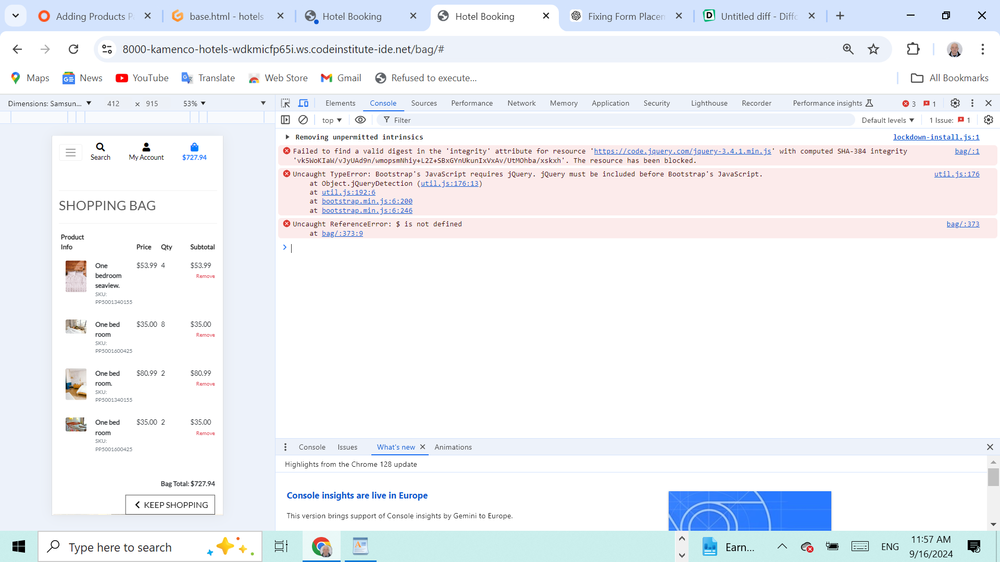
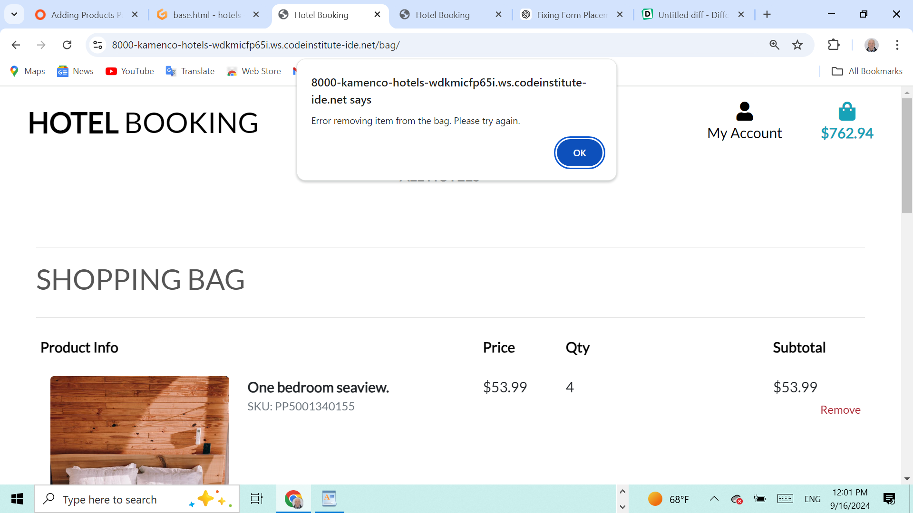

# hotels

When clicked on the link for removing the items in the bag.html showed the above message in the console. JQuery was not included before  bottstrap's JavaScript.This error was resolved by changing the order of CDN links in the head of base.html as follows:

       
        
        

      

When clicked the link for removing the items in the bag.html was not working, and showed a message "Error removing item from the bag. Please try again." This bug was resolved by adding:
The 'item_id' : itemId to the variable var data = {

       var data = {
                    'csrfmiddlewaretoken': csrfToken,
                    'item_id': itemId
      
This happens only after I made sure the URL in the AJAX request (/bag/remove/${itemId}/) matches the correct route for removing an item in Django.

### Issues to resolve

Removed integrity checks for jQuery to avoid the integrity validation issue.