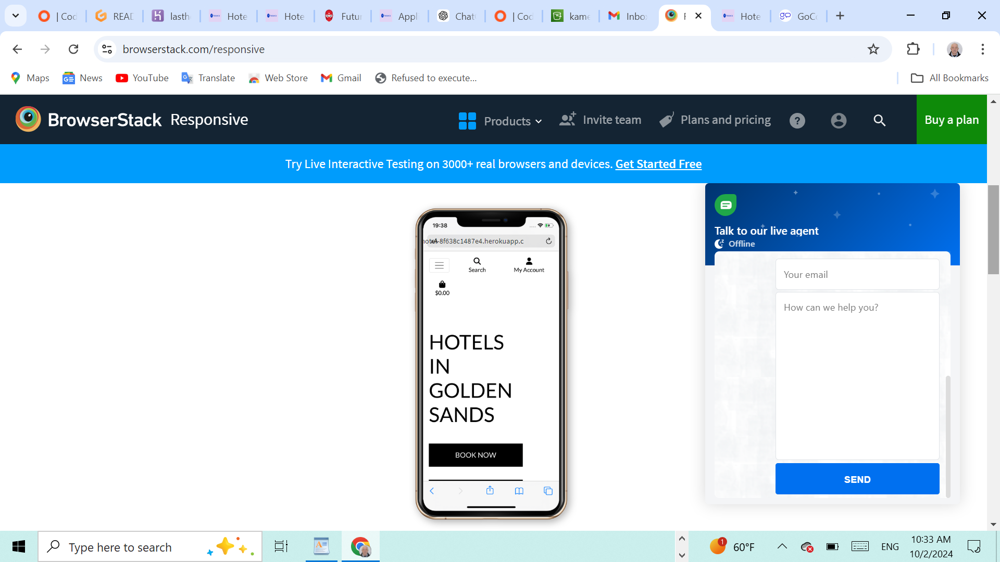
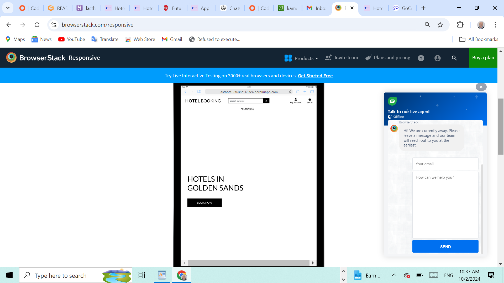
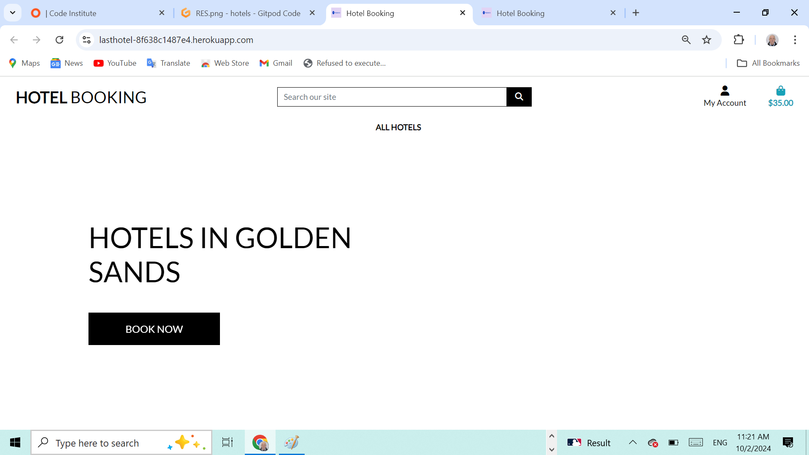
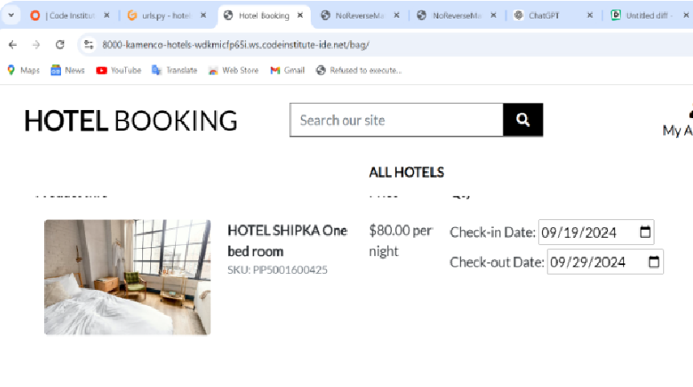

# Hotel Booking Application

## Performance of the web page on different devices

[Click on this link to visit the site on Heroku](https://lasthotel-8f638c1487e4.herokuapp.com/)

# Content

## Table of Content 
1. [Wireframe](#wireframe)
2. [UX Description](#ux-description)
3. [Technologies used](#technologies-used)
4. [Website Features](#website-features)
5. [Features to implement](#other-features)
6. [Agile palnning](#agile-planning)
7. [Project structure](#project-structure)
8. [Testing and Validation](#testing-and-validation)
9. [Bugs and Issues](#bugs-and-issues)
10. [404 page](#notfound-page)
11. [Deployment](#deployment)
12. [Credits](#credits)

---

## [Wireframe](#wireframe)

Hotel booking ia an application for making hotel reservations in two hotels in the seaside resort of Golden Sands - Bulgaria. The hotel owners can take online booking by receiving payments directly from the checkout page by the implemented stripe payment. From the admin panel the hotel owners can review their orders (bookings), update their passwords and products.  This project is built using Django and is deployed on Heroku.

---

## [UX Description](#ux-description)

This site was designed predominantly for hotel owners, and holiday makers. The users can make reservations payng from the checkout page by the stripe technology. The user receives also email with the reservation period, reservation number and overnights number, number of adults and children. The site could be developped to fully bookable site for tourist travel and business trips, with implementation of the so called dynamic packaging.

The layout is kept pretty simple, with the home page having link to the product page from where the site user can make the booking, by choosing the products by their price or cathegory.

---

## [Technologies used](#technologies-used)

- HTML5, Django templates, were used to structure my website. There is only one page base.html of this website  and using Django template mark up the rest of the pages extend the base.html Semantic element have been used like container, row, form, div.
 Responsive design was implemented by the code in the head with metatag defining the control of page's dimensions and scaling.

- CSS3, Bootstrap: Bootstrap container class provides a responsive fixed-width container.
 The row class is used to create a horizontal group of columns.Justify-content-center: This class centers the content horizontally within the row. col-sm-8: sets the width of the content to 8 columns out of a 12-column grid on small and larger devices, and you can adjust it as needed.
 btn-block uset to buttons for full-width styling. button classes to btn-primary and btn-danger for better visual distinction. Responsive web design is used to resize, and shrink, the content to make it look good on any screen.  Box sizing border box was used to  padding and border of element's total width and height. Media query with breakpoint of 420px was used for the responsiveness of the page. Hover css was used on the nav bar onclicking the login, and also onclicking the bag logo in the nav panel. However additional html page were added to the base.html and index.html like main-nav.html and mobile-top-header.html by the Django template language using 

            
            and 

- JavaScript. Used to provide functionality to my website. Event listener used is to handle form submission and send the form data using Stripe. Onsubmit attribute in the order form makes connection with the stripe application and displaying the order to the  customer by loading checkout-success.html

- Python3 Datetime and dotenv, python libraries are imported in the main python file. Postgres is installed,JSON is used for the products database. Database models are defined for Cathegories and Products.
. Ensured Unique URLs in the project.urls file and the applications urls.py. 

- Github - The cloud based service for hosting repositories for over 73 million developers
- Git - Used to add, commit and push my changes to the server and to create a repository with the help of The Code Institute template.
- Favicon.io - Used to source my favicon icons for my website.
- Google Fonts - Used to source different fonts in my css file. Google font were used Roboto.
- This page was made with Visual Studio Code on codeinstitute cloud IDE, and for deploying the pages the git add . git commit and git push commands were used.
- Whitenoise is installed to handle the static files to be displayed on heroku.
- AWS S3 is installed to handle the dynamic files, still not fully implemented.
- Heroku was used to deploy the site.
  
---

## [Website Features](#website-features)

- View the products page.
- Make reservations through a contact form and make payments.
- Login and manage the products, the orders.
- Send emails to the customer and display checkout_success.html.
- Send email for reservations.

---

## [Features to implement](#other-features)

Given more time to invest in the project, I would like to implement some more features: 

- The products page should have date time dropdown picker used to dynamically pick from calendar the stay period, update the total when the customer chooses the product (hotel room). This feature will be implemented in the future. Java Script must be used to dynamically change the total. This feature is not implemented in this site. A database should be created to check if there are rooms available and if there are not should display a message There are no rooms available. 

  
- The form of the checkout page should send the data to the stripe, it makes attempt but get an error which I have explained in the bugs section, and this problem has not been solved.

- The AWS S3 was installed but not fully implemented and the dynamic files and pictures are not displayed on the heroku server.

- This project fails to make any payments, the checkout page is displayed properly on the development server, makes an attempt but is not making an order, and the attempt is not successful in the stripe dashboard, does not create order in the admin panel.

- 404.html file is not implemented ad many basic functionality are still not working.
  
 ---
 
## [Agile planning](#agile-planning)

Severel steps were taken into consideration to develop this project. **Requirements** were detailed, **analyses** performed to see what technologies might be used, the **design** was made using bootstrap and CSS combined the **development** was carried out on gitpod.io, **testing**  manually, and authomated was not made. **User stories** are devided into four sections. 
  + Registration and user accounts 
  + Viewing and navigating through the products 
  + Sorting and searching 
  + Purchasing and checkout.

Several development cycles were followed **1st cycle iteration** creating the HTML and CSS structure. **2nd cycle iteration** implementing Django template language and logic. **3rd cycle iteration** creating the JSON database for the hotels. **4th cycle iteration** Creating SQLLite database with models for categories and products. **5th cycle iteration** Creating the checkout page and implementation of the payment process using stripe.com

---

 ## [Project structure](#project-structure)

    |-- bag
      |--migrations
      |--templates
        |--bag.html
      |--admin.py
      |--contexts.py
      |--models.
      |--urls.py
      |--views.py
    |-- booking
      |-- settings.py
      |-- urls.py
      |-- views.py
    |-- checkout/ 
      | |-- checkout
      | | |-- css/
      | |   |-- checkout.css
      | | |-- js/
      | |    |-- stripe_elements.js
      | |-- templates
      | | |-- checkout
      | | |   |-- checkout.html
      | | |   |-- checkout_success.html
      | |-- admin.py
      | |-- models.py
      | |-- urls.py
      | |-- views.py
    |-- home
      |--templates
        |-- index.html
      |--admin.py
      |--models.py
      |--urls.py
      |--views.py
    |--media/
    |--products
    | |--fixtures/
    | | |--categories.json
    | | |--products.json
    | |--templates
    | | |--product_detail.html
    | | |--products.html
    | |--models.py
    | |--urls.py
    | |--views.py
    |--profiles/
    |--static/
    |--staticfiles
    |--templates
    |--gitignore
    |--env.py
    |--manage.py
    |--Procfile
    |--requirements.txt
      
    ---  
    
 ## [Testing and Validation](#testing-and-validation)

** This site has not been tested for anything as many functionalities have not been implemented.**
---
## [Bugs and Issues](#bugs-and-issues)

[Bugs and Issues](#bugs-and-issues)

When clicked on the link for removing the items in the bag.html showed the above message in the console. JQuery was not included before  bottstrap's JavaScript.This error was resolved by changing the order of CDN links in the head of base.html as follows:

       
        
        

      

When clicked the link for removing the items in the bag.html was not working, and showed a message "Error removing item from the bag. Please try again." This bug was resolved by adding:
The 'item_id' : itemId to the variable var data = {

       var data = {
                    'csrfmiddlewaretoken': csrfToken,
                    'item_id': itemId
      
This happens only after I made sure the URL in the AJAX request (/bag/remove/${itemId}/) matches the correct route for removing an item in Django.

This bug is unresolved.

I am checkin the validity of the API key. We see there is no error in the terminal.

Checking the validity with a wrong key and we see Stripe Error: 
Invalid API key provided: sk_test:*********************XXX

The error stripe.PaymentIntent.create disappeared now the terminal givs another error"POST/checkout_cash_checkout_data/ HTTP/1.1" 404

---

## [404.html](#notfound-page)

      <body>
    

        <h1>404 - Page Not Found</h1>
        
Sorry, the page you're looking for doesn't exist.

        <a href="" class="btn">Back to Home</a>
    

</body>
   
Django only shows the custom 404 page when DEBUG = False in settings.py file. When DEBUG = True, Django shows its default, detailed error page to help with development.
If a user tries to visit a URL that does not exist or is not mapped to any view in urls.py file, Django will return a 404 status code, which triggers the 404.html template.

 - ---

## [Deployment](#deployment)

Heroku deployment
To deploy Your App to Heroku, you have to :

+ Create a Heroku account.
+ From the dashboard select create new app.
+ Enter a name for your app, it needs to be unique, and select your region then press create app.
+ Select settings at the top of your app page.
+ Press reveal config vars.
+ Also add PORT in key input and 8000 as value input.
+ Scroll down and press the add buildpack button.
+ Scroll back up and select Deploy at the top of your app page.
+ Choose your deployment method, when choosing Github, you will have to connect to your account.
+ Then choose which repo you want to deploy and connect to it.
+ Choose if you want to deploy automatic or manual, and press deploy.

**To fork this repository on Github, you have to:**

+ Go to my GitHub repository.
+ In the top-right corner of the page, click Fork.
+ Under "Owner," select the dropdown menu and click an owner for the forked repository.
+ Click Create fork.

**To clone this repository, you have to:**

+ Go to my GitHub repository.
+ Above the list of files, click Code.
+ Copy the URL for the repository.
+ Open Git Bash.
+ Change the current working directory to the location where you want the cloned directory.
+ Type git clone, and then paste the URL you copied earlier.
+ Press Enter to create your local clone.

---

## [Credits](#credits)

 The idea for the bootstrap design was taken from boutique-ado lesson from codeinstitute course for full-stack developpers. The boutique-ado lectures were used as a follow through and for the functionality implementation.
 
 This site was build with the help of www.chatgpt.com, but most important with the lectures of www.codeinstitute.net and namly the tutors of the codeinstitute which are experienced and can be very helpful.
 
 Pictures were taken from pexels.com
 
 Some of the styling was made with the help of www.bootstrap.com 
 
 The icons were taken from fonr awesome.com
 
 The photos were taken from www.pexels.com
 
The idea for the site was accepted from the Code Institute reccomendation for project 5. 

This side is used with the help of Codeacademy's course and the help of the tutors and facilitators, and mentors. Special thanks to facilitator Laura.

[Back to top](#wireframe)

