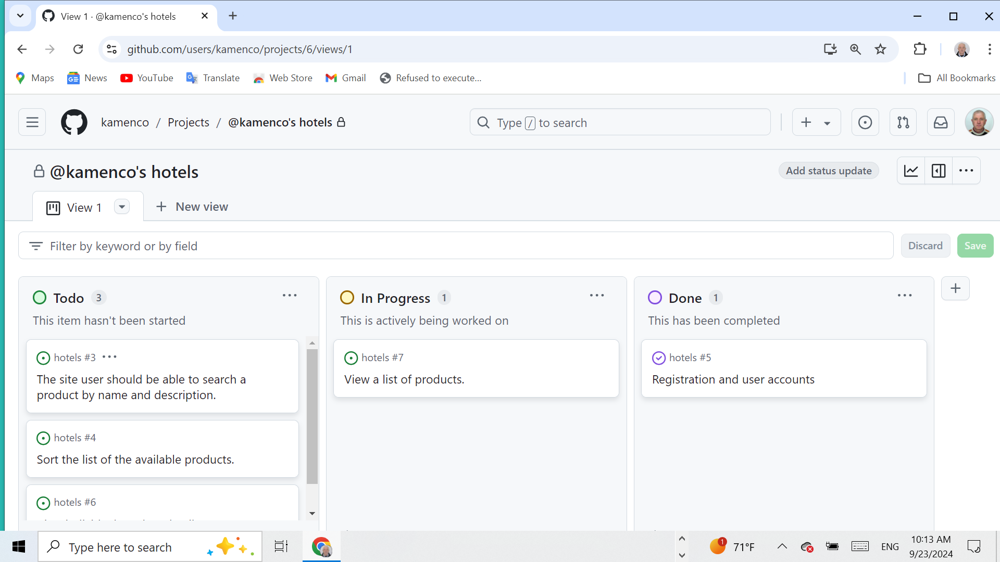
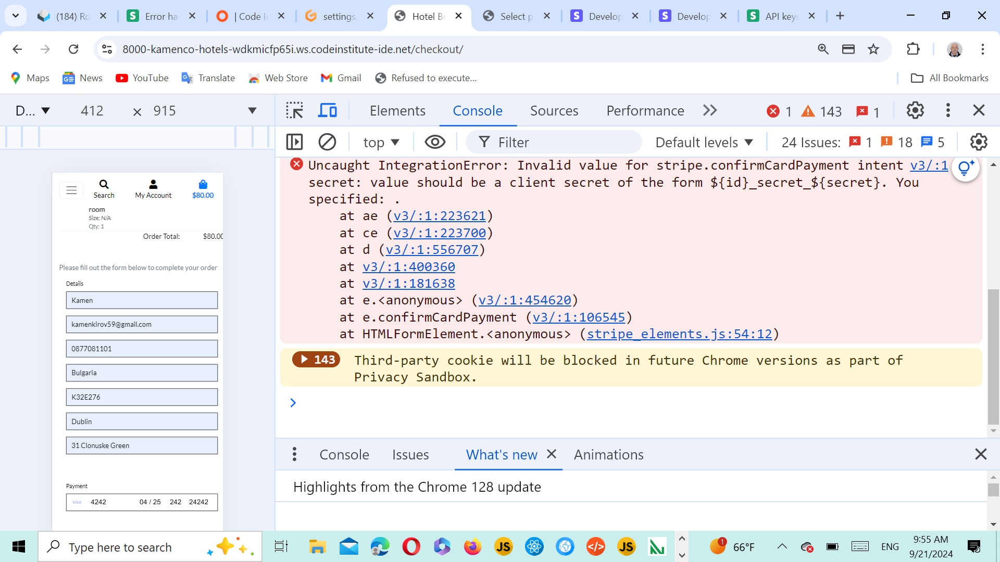
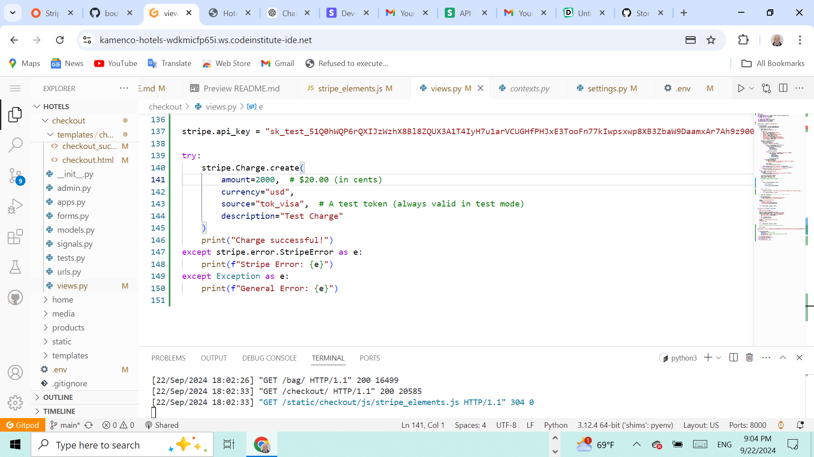
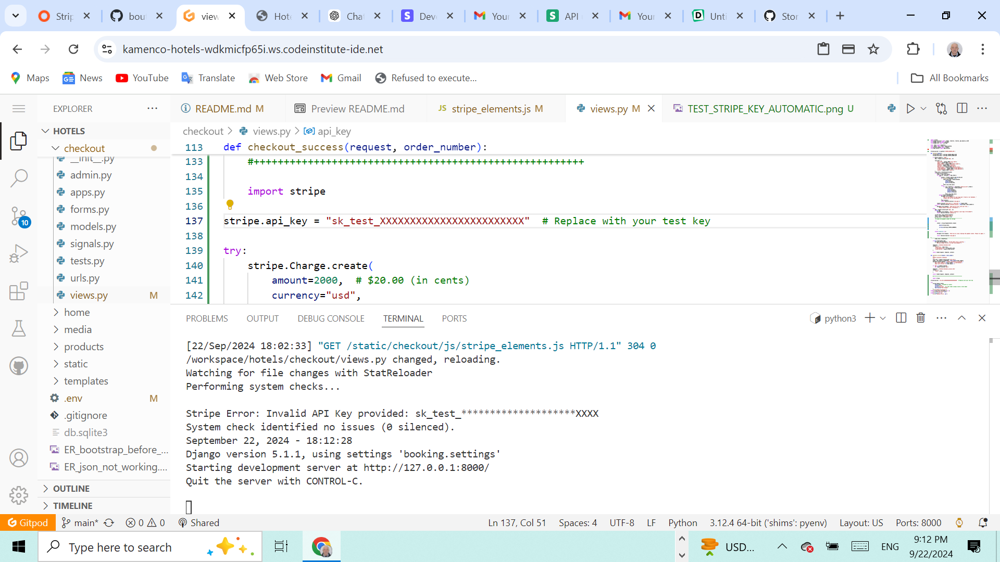
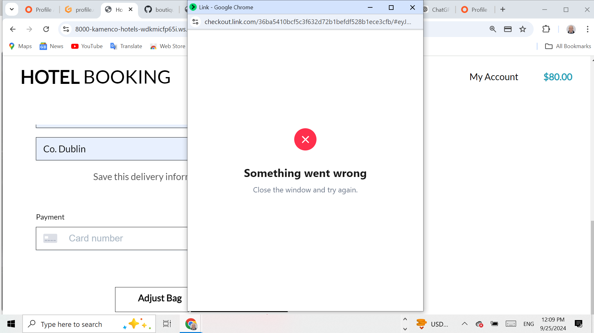

# hotels

## Table of Content 
1. [Wireframe](#wireframe)
2. [UX Description](#ux-description)
3. [Technologies used](#technologies-used)
4. [Website Features](#website-features)
5. [Features to implement](#other-features)
6. [Agile palnning](#agile-planning)
7. [Project structure](#project-structure)
8. [Testing and Validation](#testing-and-validation)
9. [Bugs and Issues](#bugs-and-issues)
10. [404 page](#notfound-page)
11. [Deployment](#deployment)
12. [Credits](#credits)

### Issues to resolve

Removed integrity checks for jQuery to avoid the integrity validation issue.

# Varna Eats - Restaurant

## Performance of the web page on different devices

[Click on this link to visit the site on Heroku](https://dines-kamen-9b44aac7c04a.herokuapp.com/)

# Content

## Table of Content 
1. [Wireframe](#wireframe)
2. [UX Description](#ux-description)
3. [Technologies used](#technologies-used)
4. [Website Features](#website-features)
5. [Features to implement](#other-features)
6. [Agile palnning](#agile-planning)
7. [Project structure](#project-structure)
8. [Testing and Validation](#testing-and-validation)
9. [Bugs and Issues](#bugs-and-issues)
10. [404 page](#notfound-page)
11. [Deployment](#deployment)
12. [Credits](#credits)

---

## [Wireframe](#wireframe)

Varna Eats is a web application that allows users to view the menu, make reservations, and manage tasks. This project is built using Flask and is deployed on Heroku.

---

## [UX Description](#ux-description)

This site was designed predominantly for restaurant owners, where they can present their restaurants, the menus, and where they can update the manues using json database, they can also add recepies, update recepies and delete recepies with using jaso as a database. Form the application taskmanager, using databaase SQLLIte the owner or the manager of the restaurant can add tasks, update tasks and delete tasks. The site has also a interactive javascript map facilitating the customers by showing the restaurant's whereabouts. 

The layout is kept pretty simple, with three pages describing the Bulgarian cuisine, the menu page and the contact page from where the customer can make reservations by filling and sending the form. At the far right is the login button from where the owner can log in to update, delete and add recepies of the menu page. From there he can also add tasks, update and delete tasks, helping the owner to better organize his business.

---

## [Technologies used](#technologies-used)

- HTML5, Jinja, . Used to structure my website. There is only one page base.html of this website  and using Jinga mark up the rest of the pages extend the base.html

 Semantic element have been used like container, row, form, div.
 
  Responsive design was implemented by the code in the head with metatag defining the control of page's dimensions and scaling.

- CSS3, Bootstrap: Bootstrap container class provides a responsive fixed-width container.
 The row class is used to create a horizontal group of columns.Justify-content-center: This class centers the content horizontally within the row. col-sm-8: sets the width of the content to 8 columns out of a 12-column grid on small and larger devices, and you can adjust it as needed.
 btn-block uset to buttons for full-width styling. button classes to btn-primary and btn-danger for better visual distinction.

 Responsive web design is used to resize, and shrink, the content to make it look good on any screen.  Box sizing border box was used to  padding and border of element's total width and height. Media query with breakpoint of 420px was used for the responsiveness of the page. Hover css was used on the nav bar onclicking the login, and also onclicking the buttons in the nav panel.

- JavaScript. Used to provide functionality to my website. Event listener used is to handle form submission and send the form data using EmailJS. Included the EmailJS SDK script in the contact.html file. Javascript was used to embed the google map. JavaScript function confirmDelete was used for the defensive design of the delete task. confirmDelete function is used from base.htm  confirmDeleteRecipe and confirmDeleteTask functions are defined and utilized within individual HTML templates.Onsubmit attribute in the delete form calls confirmDelete(event), which asks for confirmation before submitting the delete form. By clearly defining separate routes and ensuring the JavaScript functions are scoped to specific pages, I avoid collisions between the delete actions on different pages. This approach helps to ensure that both the delete functionality for recipes and tasks work independently without interfering with each other.

- Python3 Datetime and dotenv, flask libraries are imported in the main python file. SQLAlchemy is installed,JSON is used for the menu database. Database models are defined for Cathegories and tasks.
The delete_task, add_task, update_task routes are used to correctly handle POST requests to delete, update and add a task and redirect back to the tasks list. Used url_for function to correctly points to the Flask routes. Delete_task, update-task, and add_task routes accept the correct HTTP methods (GET, POST). Ensured Unique URLs for Delete Actions. Making sure the URLs for the delete actions in both update_menu.html and update_task.html are distinct. Handling POST Requests: The update_menu function is updated to load recipes at the beginning. If the request is a POST request and the form contains 'add', it adds the new recipe. If the form contains 'delete', it deletes the selected recipe and writes the updated list back to list.json.

- Github - The cloud based service for hosting repositories for over 73 million developers
- Git - Used to add, commit and push my changes to the server and to create a repository with the help of The Code Institute template.
- Favicon.io - Used to source my favicon icons for my website.
- Google Fonts - Used to source different fonts in my css file. Google font were used Roboto.
- CoralDraw was used to illustrate this page with the flow chart's logic.
- This page was made with Visual Studio Code on gitpod.io, and for deploying the pages the 
git add . git commit and git push commands were used.
- Gitpod.io was used to work on the project.
- Heroku was used to deploy my site.
  
---

## [Website Features](#website-features)

- View the menu with various recepies.
- Make reservations through a contact form.
- Login and manage the menu (add, update, delete recipes).
- Task management functionality including adding, updating, and deleting tasks.
- Send email for reservations

---

## [Features to implement](#other-features)

Given more time to invest in the project, I would like to implement some more features: 

- The menu page except menues to have prices for each dish with an option for online payment and booking, and also a delivery for home.
  
- The form from the contact page should have dropdown menu for date and time of the reservation, also dropdaown for the main course, starters, desserts, so that those booking for functions, celebrations, receptions and parties can fix their menu beforehnd online.
- To fulfil authomatic testing. For now only manual testing is carried out.  
- This project can target restaurant owners and catering services.
  
 ---
 
## [Agile planning](#agile-planning)

Severel steps were taken into consideration to develop this project. **Requirements** were detailed, **analyses** performed to see what technologies might be used, the **design** was made using bootstrap and CSS combined the **development** was carried out on gitpod.io, **testing** was made only manually, the authomatic testing was pade with python. **User stories** are devided into four sections + Registration and user accounts +Viewing and navigating through the products + sorting and searching + Purchasing and checkout.
Several development cycles were followed **1st cycle iteration** creating the HTML and CSS structure. **2nd cycle iteration** implementing Django template language and logic. **3rd cycle iteration** creating the JSON database for the hotels. **4th cycle iteration** Creating SQLLite database with models for categories and products. **5th cycle iteration** Creating the checkout page and implementation of the payment process using stripe.com

---

 ## [Project structure](#project-structure)

       |-- run.py
      |-- form_handler.py
      |-- env.py
      |-- requirements.txt
      |-- taskmanager/ 
      | |-- init.py
      | |-- templates/
      | | |-- base.html
      | | |-- index.html
      | | |-- menu.html
      | | |-- contact.html
      | | |-- login.html
      | | |-- update_menu.html
      | | |-- tasks.html
      | | |-- add_task.html
      | | |-- update_task.html
      |-- .env
      
    ---  
    
 ## [Testing and Validation](#testing-and-validation)

 The HTML and CSS coding was tested on https://validator.w3.org

 

 Javascript validation. The javascript files have been checked on www.jshint.com. 

 

 Javascript validation

 

---
Form submission validation. Form submission using Javascript.

Validation from emaijs.com

 Python validation

 
 
---

The page is tested on different browsers Chrome, Firefox, Safari, Opera. The page is responsive and contains all the functions accross differenr screens and sizes. The accessibility testing.
For testing accesibility and SEO and Best Practices, I used Lighthouse in Dev tools. 
Lighthouse runs an audit of your website and feeds back a set of scores for accessibility, SEO and best practices among others.

---
## [Bugs and Issues](#bugs-and-issues)

[Bugs and Issues](#bugs-and-issues)

When clicked on the link for removing the items in the bag.html showed the above message in the console. JQuery was not included before  bottstrap's JavaScript.This error was resolved by changing the order of CDN links in the head of base.html as follows:

       
        
        

      

When clicked the link for removing the items in the bag.html was not working, and showed a message "Error removing item from the bag. Please try again." This bug was resolved by adding:
The 'item_id' : itemId to the variable var data = {

       var data = {
                    'csrfmiddlewaretoken': csrfToken,
                    'item_id': itemId
      
This happens only after I made sure the URL in the AJAX request (/bag/remove/${itemId}/) matches the correct route for removing an item in Django.

This bug is unresolved.

I am checkin the validity of the API key. We see there is no error in the terminal.

Checking the validity with a wrong key and we see Stripe Error: 
Invalid API key provided: sk_test:*********************XXX

The error stripe.PaymentIntent.create disappeared now the terminal givs another error"POST/checkout_cash_checkout_data/ HTTP/1.1" 404

---

## [404.html](#notfound-page)

      @app.route("/update_task/<int:task_id>", methods=["GET", "POST"])
      def update_task(task_id):
        task = Task.query.get_or_404(task_id)
        if request.method == "POST":
        task.task_name = request.form.get("task_name")
        task.task_description = request.form.get("task_description")
        task.is_urgent = True if request.form.get("is_urgent") else False
        due_date_str = request.form.get("due_date")

        
       task = Task.query.get_or_404(task_id)
   
This line attempts to fetch a Task object from the database using the task_id. If the task_id does not exist in the database, Flask will automatically return a 404 Not Found error.
If we have a task with task_id=1 in database. When visiting /update_task/1, the application should work correctly. However, if you visit /update_task/100 and there is no task with task_id=100, the Task.query.get_or_404(100) will trigger a 404 response.

 - ---

## [Deployment](#deployment)

Heroku deployment
To deploy Your App to Heroku, you have to :

+ Create a Heroku account.
+ From the dashboard select create new app.
+ Enter a name for your app, it needs to be unique, and select your region then press create app.
+ Select settings at the top of your app page.
+ Press reveal config vars.
+ Also add PORT in key input and 8000 as value input.
+ Scroll down and press the add buildpack button.
+ Scroll back up and select Deploy at the top of your app page.
+ Choose your deployment method, when choosing Github, you will have to connect to your account.
+ Then choose which repo you want to deploy and connect to it.
+ Choose if you want to deploy automatic or manual, and press deploy.

**To fork this repository on Github, you have to:**

+ Go to my GitHub repository.
+ In the top-right corner of the page, click Fork.
+ Under "Owner," select the dropdown menu and click an owner for the forked repository.
+ Click Create fork.

**To clone this repository, you have to:**

+ Go to my GitHub repository.
+ Above the list of files, click Code.
+ Copy the URL for the repository.
+ Open Git Bash.
+ Change the current working directory to the location where you want the cloned directory.
+ Type git clone, and then paste the URL you copied earlier.
+ Press Enter to create your local clone.

---

## [Credits](#credits)

 The idea for the bootstrap design was taken from https://www.w3schools.com/.
 
 This site was build with the help of www.chatgpt.com, but most important with the lectures of www.codeinstitute.net and namly the lectures for emailjs.com and the task application.
 
 Pictures recepies and links for the pictures were taken from www.bgtown.com
 
 Some of the styling was made with the help of www.bootstrap.com 
 
 The chef's logo was taken free from https://logo.com/
 
 The photos were taken from www.pexels.com
 
The idea for the site was accepted from the Code Institute reccomendation for project 4. 

This side is used with the help of Codeacademy's course and the help of the tutors and facilitators, and mentors. Special thanks to facilitator Laura for sending me useful links for testing, thanks to my tutor Mr. Medale.

[Back to top](#wireframe)

